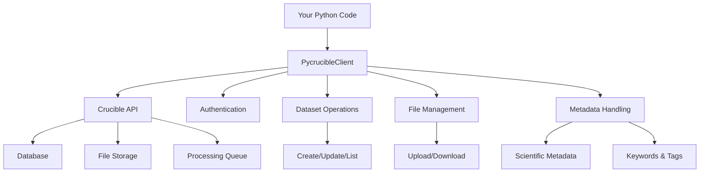

# PycrucibleClient Documentation

Welcome to the PycrucibleClient documentation! This Python library provides a convenient interface to interact with the Crucible API - the Molecular Foundry data lakehouse for experimental synthesis and characterization data.

## Quick Navigation

- **[Getting Started](getting-started.md)** - Installation and setup
- **[Tutorial](tutorial.md)** - Step-by-step guide with examples
- **[API Reference](api-reference.md)** - Complete function documentation
- **[Examples](examples.md)** - Common use cases and patterns

## What is PycrucibleClient?

PycrucibleClient is a Python client library that simplifies interaction with the Crucible API. It provides:

- **Easy Authentication**: Simple API key-based authentication
- **Dataset Management**: Create, update, and manage experimental datasets
- **File Operations**: Upload, download, and organize data files
- **Metadata Handling**: Store and retrieve scientific parameters
- **Sample Tracking**: Manage physical samples and their relationships
- **Workflow Integration**: Automated processing and data synchronization

## Key Features

### 🗂️ Dataset Management
Organize your experimental data with rich metadata, file associations, and access controls.

```python
# Create a dataset with metadata
dataset = client.create_dataset(
    dataset_name="Temperature Study",
    measurement="Raman Spectroscopy",
    scientific_metadata={
        "temperature": 298.15,
        "laser_wavelength": 532,
        "integration_time": 10
    }
)
```

### 🧪 Sample Tracking
Track physical samples through hierarchical relationships and type-specific metadata.

```python
# Create parent-child sample relationships
parent = client.add_sample(sample_name="Bulk Crystal")
child = client.add_sample(
    sample_name="Cleaved Surface",
    parents=[parent]
)
```

### 🔄 Automated Workflows
Process data through ingestion, analysis, and synchronization pipelines.

```python
# Upload, process, and sync data
client.upload_dataset(dataset_id, "spectrum.dat")
ingest_req = client.request_ingestion(dataset_id)
client.wait_for_request_completion(dataset_id, ingest_req['id'], 'ingest')
client.send_to_scicat(dataset_id)
```

### 🔍 Powerful Search
Find datasets using keywords, metadata, and complex filtering.

```python
# Search by keyword and metadata
datasets = client.list_datasets(
    keyword="spectroscopy",
    temperature=298.15
)
```

## Architecture Overview



## Core Concepts

### Datasets
Central containers for experimental data, containing:
- **Metadata**: Experimental parameters and conditions
- **Files**: Raw data, processed results, documentation
- **Relationships**: Links to samples, instruments, projects
- **Access Control**: User and group permissions

### Samples
Physical materials that experiments are performed on:
- **Hierarchical**: Parent-child relationships for sample preparation
- **Typed Metadata**: Domain-specific schemas (biological, materials, etc.)
- **Multi-dataset**: One sample can be associated with multiple datasets

### Projects
Organizational units for research:
- **Collaboration**: Team member management
- **Data Organization**: Group related datasets and samples
- **Access Control**: Project-based permissions

### Instruments
Scientific equipment specifications:
- **Provenance**: Track which instrument generated data
- **Configuration**: Store instrument settings and parameters
- **Access Management**: Instrument-based permissions

## Getting Help

- **Documentation**: Browse the sections linked above
- **Examples**: Check the [examples page](examples.md) for common patterns
- **API Reference**: See the [complete function reference](api-reference.md)
- **Issues**: Report bugs or request features on GitHub

## Next Steps

1. **[Install PycrucibleClient](getting-started.md#installation)**
2. **[Set up authentication](getting-started.md#authentication)**
3. **[Follow the tutorial](tutorial.md)**
4. **[Explore examples](examples.md)**

Ready to get started? Head to the [Getting Started guide](getting-started.md)!